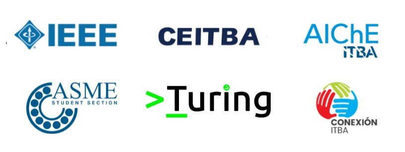

# Curso introductorio de Python
Curso gratuito y abierto de Python, creado en colaboración con ASME-CEITBA-IEEE-TURING en el Instituto Tecnológico de Buenos Aires.

# ¡Clases!
<a href="http://bit.ly/2U6CEKY">Clase 1</a>

### Organizaciones originales

### Organizaciones asociadas ¡Gracias por su ayuda!

# Modalidad
* 4 clases de tres horas, una vez por semana.
* ¡Traigan laptop!
* ¡No se requiere conocimiento previo de la programacion!

